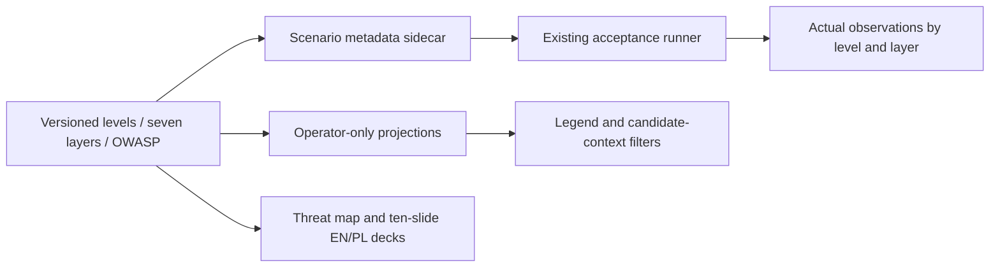

# Two-axis threat evidence for Laya Sec Layer

## TLDR

Operators and reviewers need a versioned L0–L5 scenario ladder and the user's
seven system layers across acceptance evidence, the dashboard and presentation.
Today test cases have no threat-axis tags, the timeline shows decisions/reasons
only, and the suggested Java risk-score disclosure is absent from this Python
repository. Proposed work is evidence classification and score-privacy regression
coverage; the taxonomy never grants or changes permissions.

## Resolved scope

The user supplied seven layers: identity/permissions, input, data, actions,
output, consumption, supply chain. Keep this order and those meanings.
Implement one taxonomy feature and its test/report/UI/documentation consumers.
Future defenses (new DLP, signed feeds, four eyes, rate limits, OIDC and delegated
user/agent privilege intersection) remain explicitly separate work, not implied
by adding tags. Existing protections and known false semantic results stay intact.

## Decisions

- Labels on authored scenarios are known metadata. Runtime intent/sophistication
  cannot be inferred from a denial: use candidate context and unknown defaults.
- Bind references to OWASP LLM 2025 and Agentic Applications 2026 (Dec 2025).
- Preserve frozen v1/v2 corpora and report hashes; use a sidecar metadata index.

## Architecture and contracts

1. Add a small versioned runtime taxonomy module with the six levels and seven
   layers, OWASP mappings and explicit implemented/partial/planned limits. Prefer
   current Python/packaged-web primitives, no new dependency or inference call.
   Layers have stable IDs `identity`, `input`, `data`, `actions`, `output`,
   `consumption`, `supply_chain`; preserve the user's order/Polish definitions.
2. Add requested `testdata/test-cases.json` as a strict **sidecar metadata index**.
   Every T01–T48 acceptance scenario and every existing frozen semantic v1/v2
   case is referenced by stable ID/dataset, with `level`, nonempty `layers`, and
   versioned OWASP categories. Do not duplicate content, rewrite expected labels,
   alter original corpora bytes or invent new passes. Unimplemented examples such
   as PESEL/base64/general normalization, active-image exfiltration, signed feeds,
   request-rate limits and two-person change approval remain explicit gaps.
3. Extend the existing acceptance runner to validate exact/unique complete
   references and allowed taxonomy IDs/versions. Preserve legacy inventory and
   existing report fields; add versioned metadata, source hashes and summaries
   per level and per layer. Denominators distinguish declared scenarios from
   executed parametrized test observations. A scenario's control checks pass only
   if every mapped selector has actual complete passing observations. Missing,
   failed, skipped and collection-error cases cannot silently pass. Partial,
   measured and gap readiness remain partial/measured/gap even when a mapped
   control test passes; frozen semantic measurements are not rerun or converted
   to success. Shared selectors are not presented as independent attack samples.
4. Add protected GET `/admin/threat-taxonomy` and additive `threat_context` only
   to `/admin/events` projections. No persistent AuditEvent/storage migration,
   public action/model/MCP schema change, telemetry v1 field change, or privilege
   change. Reuse the existing operator authentication/session router boundary.
   Project from trusted reason/event/operation fields without reading raw prompts
   or reclassifying with an LLM. Runtime context has `candidate_levels`, `layers`,
   versioned OWASP IDs, taxonomy version and an explicit mapping basis. Successful
   or ambiguous/unmapped records use unknown/empty candidates. No hostile intent,
   attacker attribution, calibrated severity or measured sophistication is inferred.
5. Dashboard: visible L0–L5 legend with true current controls/gaps; timeline
   context next to OWASP plus level and layer filters over the explicitly marked
   loaded event window. Keep decision filters, empty/error/unknown states,
   keyboard accessibility, narrow layouts and safe text rendering. Older payloads
   without context render unknown. Context is diagnostic, never authorization.

## Risk-score disclosure verification

`SemanticCheck.java` and `testdata/test-cases.json` do not exist on base e582fe6.
Current ActionResponse contains coarse reason codes/action_id/trace_id and no
SemanticResult. Internal AuditEvent can retain raw_scores; admin/export code
explicitly projects them out. Verify real REST, model and MCP denial responses
with distinctive synthetic native score values, zero forbidden dispatch/output,
IDs correlated to durable private audit, and no score/threshold/question/checkpoint
metadata in client-visible denial. Verify the operator timeline/export projections
also remain minimized. Add meaningful regression coverage; do not claim a
nonexistent Java fix or break coarse public reason codes. An allow/deny endpoint
still gives binary feedback; absence of numeric scores does not defeat adaptation.
If a real leak is reproduced, report it and isolate the smallest compatible fix.

## Honest control inventory

Existing: credential-owned roles/operations/tenant/root, model/tool allowlists,
scoped data reads, exact human mail approvals, bounded synthetic-secret/email
DLP, buffered output checks, persistent tool/model budgets, native deadlines,
installation-wide semantic-call quota, operator sessions/CSRF, last-good audited
policy/feed CAS, pinned assets and metadata-only artifact intake.
No claim of OIDC, PESEL/IBAN/card recognition, full base64/Unicode normalization,
Llama Guard, prompt canary, whole-conversation adversarial coverage, bank vendor
integration, OS sandbox, generic loop detection, per-second admission rate,
cumulative GPU-time budgets, feed signatures or four-eyes administration.
Feed indicators are bounded literal/typed data, not arbitrary executable regex;
ReDoS from user-supplied regex is not an existing feature to patch. Existing fixed
regex/parsing limits still deserve ordinary regression/size checks. Known actual
Laya false positives and missed paraphrases remain visible.

## Sources and terminology

- OWASP LLM Top10 2025: https://genai.owasp.org/llm-top-10/
- OWASP Agentic Applications2026, published2025-12-09:
  https://genai.owasp.org/resource/owasp-top-10-for-agentic-applications-for-2026/
  Official linked PDF https://genai.owasp.org/download/52117/?tmstv=1765059207
- ASI01 goal hijack; ASI02 tool misuse; ASI03 identity/privilege; ASI04 supply
  chain; ASI05 unexpected code execution; ASI06 memory/context poisoning;
  ASI07 inter-agent communication; ASI08 cascading failures; ASI09 human-agent
  trust exploitation; ASI10 rogue agents. These are versioned references;
  L0–L5 is our explanatory scheme, not an OWASP severity scale/certification.
- Use the user's requested 2025 LLM edition intentionally even if a later edition
  exists. Mappings are our contextual crosswalk, not OWASP endorsement.

## UI/UX and documentation

Add `docs/threat-model.md` with both axes, current control evidence, gaps and a
readable Mermaid ladder; link from README/docs index/architecture/acceptance.
Add one “From accident to adaptive attacker” slide to each nine-slide EN/PL deck,
keeping final decks at ten pages. Visually render and inspect actual PDFs after
changes; generated PDFs stay ignored and are copied to the original project for
handoff. Describe evidence counts honestly; do not claim L0/L1/L3 strong merely
because the user's proposed status says so. Preserve hard control results and
experimental semantic results separately. List follow-on defenses as priorities,
not silently implemented capabilities.

## Implementation Plan

Phase1 — Versioned taxonomy and scenario evidence:
1. Implement strict taxonomy/index and stable metadata validation.
2. Extend runner summaries with meaningful failure/missing/duplicate tests;
   preserve frozen corpus hashes and existing report fields.
Phase2 — Operator presentation and denial privacy:
3. Add minimized protected projections, runtime ambiguity handling and UI filters.
4. Add actual denied-boundary privacy regressions and consumers/backward notes.
Phase3 — Verified delivery:
5. Write current threat map and ten-slide EN/PL diagram/story; render and inspect.
6. Run configured `make validate`, six existing plus relevant new JS checks,
   actual acceptance execution, and installed browser QA in a private environment.
7. Independent review, fix findings, publish scoped PR, require green CI before
   authorized merge; update the running installation only after accepted review.

These phases are one classification/evidence capability; new defenses are separate
future stories. No heavyweight semantic re-evaluation is needed for metadata/UI.
Preserve production/default private state and shared Ollama; QA uses an owned
isolated installation. Existing publication authorization and requested Cezar
`gpt-6.1-sol` execution carry forward from the project session.
