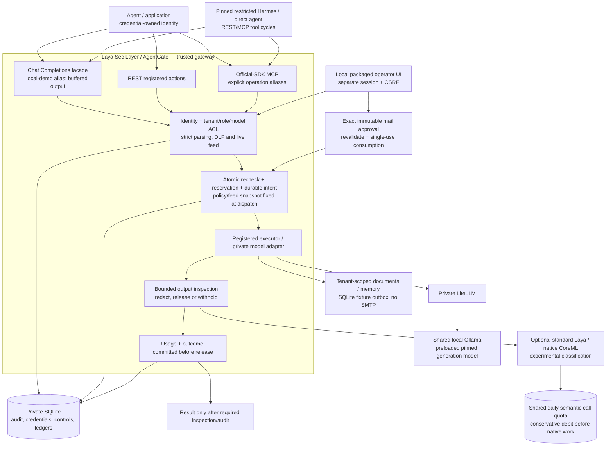
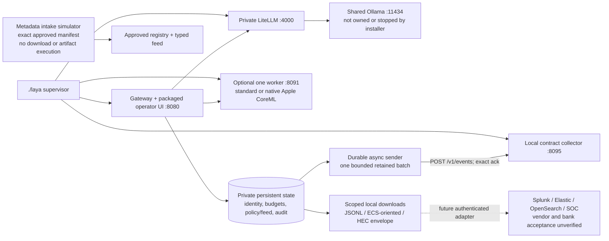

# Laya Sec Layer architecture

Snapshot and publication status: [release evidence](release-evidence.md).
The [original architecture](../AgentGate_Full_Project_Architecture.md) describes
the complete target; these diagrams describe the local integration prototype.
Solid arrows are integrated code paths; dashed arrows are proposed adapters.
This is a trusted-host boundary, not an OS sandbox.

## Two enforcement paths, one authority



Semantic calls also inspect supported model inputs and tool action text; the
placement above summarizes the output boundary. Worker results never expand
permissions. Tools generated by a model still require a separate authorized
execution. Quota exhaustion can withhold a result after a tool read; it prevents
generation when required input inspection cannot be admitted.

## Installation and evidence delivery



The real collector wire protocol is **Laya local HTTP contract collector v1**,
not HEC or Bulk API. Its exact durable acknowledgment follows transaction commit.
A lost response replays the same IDs: at-least-once delivery with deduplication.
A file envelope is a serializer result, not an indexed event or vendor receipt.
The sender reports lag/backpressure; it does not impose source audit retention or
automatically throttle gateway producers. See [telemetry](telemetry-delivery.md).

## Permission, effect and output are different events

```mermaid
sequenceDiagram
    actor Client
    participant G as AgentGate
    participant DB as SQLite authority
    participant X as Registered executor / private provider
    Client->>G: Scoped credential + canonical request
    G->>DB: Resolve identity; capture active controls
    G->>G: Validate ACL, model/destination, schema, text
    alt Hard denial
        G->>DB: Minimized denied outcome
        G-->>Client: Denied; executed=false; zero protected dispatch
    else Permitted operation (approval consumed if required)
        G->>DB: Recheck + atomic reservation + durable intent
        G->>X: Authorized dispatch with captured controls
        X-->>G: Untrusted complete result
        G->>G: Inspect/redact/withhold; optional required semantics
        G->>DB: Settle known usage + durable outcome
        G-->>Client: Actual execution flag; result only if releasable
    end
```

Pre-dispatch audit failure prevents execution; post-dispatch audit failure
withholds output and retains uncertain accounting. Approval alone does not send
mail. An output denial can follow billable/executed work. Buffered SSE delays the
first token until inspection completes; it is not incremental token enforcement.
