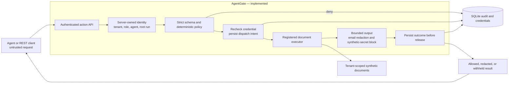
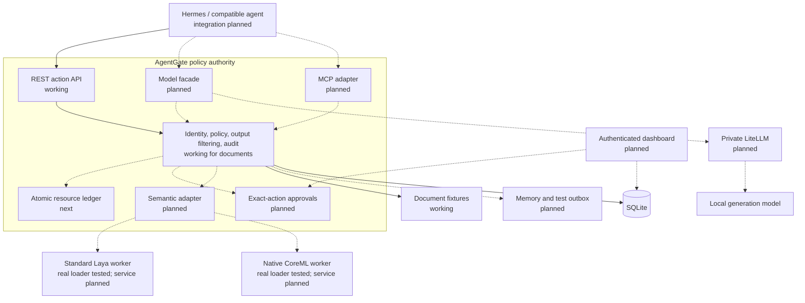

# AgentGate visual architecture

These Mermaid diagrams render directly on GitHub. The
[full design](../AgentGate_Full_Project_Architecture.md#5-system-architecture)
contains the detailed target architecture and budget state machine.

## Working document path



No fixture read occurs after a pre-execution denial. A blocked tool result may
follow an executed read; the response reports that distinction. SQLite and
fixture access assume trusted host processes. The gateway is not a host sandbox.

## Product target and implementation status



Solid edges describe implemented paths. Dashed edges describe the target.
Real Laya and CoreML smoke tests both matched 2 of 4 prewritten labels; they
are loading evidence, not a validated security classifier or gateway integration.

## Output-release boundary

```mermaid
sequenceDiagram
    actor Agent
    participant API as AgentGate
    participant DB as SQLite
    participant Tool as Document executor
    Agent->>API: Bearer credential + canonical action
    API->>DB: Resolve server-owned identity
    API->>API: Validate input, role, scope, tenant, classification
    alt Deterministic denial
        API->>DB: Persist denied outcome
        API-->>Agent: Deny; executed=false
    else Authorized document read
        API->>DB: Recheck credential + durable dispatch intent
        API->>Tool: Read registered tenant document
        Tool-->>API: Untrusted result
        API->>API: Bound, inspect, redact or withhold
        API->>DB: Persist outcome
        API-->>Agent: Decision; executed=true; result only if releasable
    end
```

Audit failure before dispatch prevents execution. Audit failure after dispatch
withholds the output. Neither outcome makes an uncertain action safe to retry.
