# Tool-attempt budgets

The document gateway can reserve one tool attempt atomically against three
server-owned scopes: tenant/UTC day, tenant/principal/UTC day, and
tenant/principal/root run. Agent identity is excluded from the keys so delegated
agents cannot multiply a root's allowance. Credential replacement does not reset
the counters. The day is sampled after acquiring the dispatch write lock.

```yaml
tool_budgets:
  tenant_day: 1000
  principal_day: 500
  root_run: 100
```

Each limit is an integer between zero and one billion. Zero denies all calls in
that scope. Omitting the block preserves the original unbudgeted policy behavior.
The shipped policy explicitly enables these limits as `document-demo:2`.
Exhaustion returns HTTP 429 with `BUDGET_EXCEEDED` and `executed: false`.
Tenant, role, or schema denial reserves nothing.

```mermaid
stateDiagram-v2
    [*] --> Dispatched: Credential recheck, reserve all scopes, commit intent
    Dispatched --> Settled: Executor returns; atomic outcome audit and charge
    Dispatched --> Uncertain: Executor raises; retain reservation
    Dispatched --> Dispatched: Outcome cannot be persisted; retain reservation
    Settled --> [*]
```



Reservations and intent share one `BEGIN IMMEDIATE` transaction. SQLite waits at
most one second for a write lock, then fails closed. Every known executor return
costs one call, including an oversized, invalid, or blocked result. An exception
keeps the reservation uncertain; there is no automatic expiry, refund, or retry.
Settlement and the outcome event commit together. Restarting cannot erase usage.

Inspect bounded counters as the trusted local operator:

```sh
uv run agentgate budgets --limit 100
```

`reserved` includes dispatched and uncertain work. `spent` is completed known
usage. Their sum is used for admission. Scope keys contain server-owned IDs and
UTC dates, not document contents or credentials. This CLI is not a public admin API.

## Upgrading existing local state

Schema 2 adds three tables to schema 1. Fresh `init-demo` uses schema 2. Existing
state requires an explicit migration; readiness fails until it is performed.
Stop the gateway first, then create a private SQLite backup (including WAL data):

```sh
uv run python - <<'PY'
import os, sqlite3
from pathlib import Path
backup = Path('.agentgate/pre-schema-2.sqlite3')
fd = os.open(backup, os.O_CREAT | os.O_EXCL | os.O_WRONLY, 0o600)
os.close(fd)
with sqlite3.connect('.agentgate/agentgate.sqlite3') as source:
    with sqlite3.connect(backup) as target:
        source.backup(target)
PY
uv run agentgate migrate
make serve
```

Migration preserves credentials and audit events, is transactional, and is safe
to repeat. For rollback, stop all gateway processes and restore the pre-upgrade
snapshot with SQLite's backup API before running the old code. A snapshot restore
discards all activity since that snapshot: only use it before admitting new work.
Once schema 2 has recorded real activity, retain it and fix forward; dropping the
ledger would erase budget accounting. There is no destructive downgrade command.

## Limits of this slice

This accounts for document call attempts. It does not account for provider money,
generation tokens, semantic inference time, or concurrent native jobs. Those need
their own units and reservations. No client idempotency or exact-action approval
is claimed; document reads are the only implemented operation. Policy reload is
still restart-only, and all processes sharing a database must use the same policy.
Independent security review is required before a production release.
