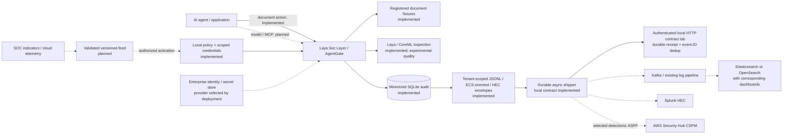

# Laya Sec Layer: enterprise integration design

The proposed layer enforces policy at the AI interaction boundary and publishes
minimized evidence to the organization's existing systems. Public references to
a bank using a technology do not establish access to its internal interfaces,
its current deployment, or approval of this product.

**Implemented here:** document enforcement, local audit, and the scoped export
formats described in [audit-export.md](audit-export.md), plus the
[durable sender and local HTTP contract lab](telemetry-delivery.md).
**Proposed below:** vendor collectors, enterprise identity, secret retrieval and
threat-feed ingestion.
No bank-system connection or vendor-server integration test has been performed.

## Connection map

Solid edges show implemented relationships, dashed edges the proposed integration
design. External analytics delivery is asynchronous; it does not become the
synchronous permission or budget authority. A locally required audit failure
already withholds output. The sender bounds its pending batch and reports source-lag backpressure without
discarding evidence. Source audit retention/admission policy remains root
integration work; the local collector has a hard row cap.

## Target interfaces and their limits

| Technology / role | Proposed integration | Current status and remaining work |
|---|---|---|
| Splunk log ingestion | HEC structured JSON events; dedicated sourcetype and restricted collector credential | Envelope serializer exists. Need authenticated TLS delivery, deployment-specific acknowledgments, durable retry/cursor, indexed-event proof. Splunk ES detections require additional field/CIM mapping and rules. [S1, S2] |
| Elasticsearch or OpenSearch search/analytics | Scoped event index and stable event ID; approved collector or Bulk API | ECS-oriented records exist. Need explicit mappings, Bulk action lines, per-item error handling, tenant-scoped sink configuration and actual index/search proof. OpenSearch mapping must be tested separately. [S3, S4] |
| Kibana / OpenSearch Dashboards | Saved views over their corresponding indexed events | No direct event publishing to a dashboard. Build counts from terminal events, distinguish denial before dispatch from blocked output, and show semantic coverage separately from confirmed threats. |
| Kafka | Canonical versioned event topic, schema contract, restricted producer and consumer identities | Planned. Test broker acknowledgments, idempotent producer settings and consumer deduplication; producer idempotence alone does not make the entire pipeline exactly once. [S5] |
| Redis in an existing pipeline | Optional deployment-specific transport/cache adapter | Planned only if the target requires it. Do not replace authoritative budget reservations or audit with a best-effort cache. Determine the actual queue/stream contract before choosing an adapter. |
| AWS Security Hub CSPM | Selected actionable detections converted into ASFF, sent through `BatchImportFindings` | Planned; account/region, IAM permission, product ARN and stable finding/update semantics required. This is not a destination for every raw audit line. Custom integration does not mean AWS partner certification. [S6] |
| CloudTrail, Config, VPC Flow Logs | Correlate AWS activity, resource configuration and network metadata with Laya evidence; derive reviewed indicators where justified | Planned consumers. These sources do not provide prompt-content enforcement. Config inventory and flow metadata are different evidence from model/tool decisions. [S7, S8, S9] |
| AWS Secrets Manager | Retrieve narrowly scoped upstream/collector secrets in the trusted service | Planned. Use approved workload credentials, bounded caching and rotation; never return secrets to agent context or event records. [S10] |
| Internal IAM, vendor unknown | OIDC for human sign-in where supported; separate workload authentication and server-owned authorization/delegation | Planned. OIDC authenticates people; it does not define agent authority or a bank's chosen vendor. Issuer/audience/expiry validation and role mapping require deployment agreement. [S11] |
| BQL reference in a job description | Discovery item only | Product/protocol/schema not established. Do not invent a BQL connector or treat a query-language mention as a deployed collection endpoint. |

## How the bank examples affect scope

The user's research distinguishes deployments, product diagrams and hiring
mentions. Preserve those distinctions. The list below records the scope of that
input; it is **not a newly verified inventory of each bank's infrastructure**.

| Context supplied by the user | Appropriate engineering conclusion |
|---|---|
| Goldman Sachs: 2016 Elastic search/log/metric usage; Kafka/Kibana/Redis pipeline | Target standard event ingestion if a compatible current endpoint is provided. A historical logging reference is not proof of a firm-wide SIEM. The Elastic 2016 talk is a public historical reference. [S12] |
| Marcus: Splunk central logs including security/fraud | Scope a possible Splunk connector to the applicable deployment; do not infer all Goldman Sachs uses it as its SIEM. |
| Goldman Sachs detection job: Splunk, Elastic, BQL | Treat as skills/tool examples, not a production architecture or integration contract. |
| GS Financial Cloud diagram: OpenSearch and Secrets Manager | These are product architecture components. A product-data connector and a SOC telemetry collector are different integrations. |
| J.P. Morgan Payments: payment-document search store | A future read-only tool connector needs document entitlement enforcement and output inspection. Do not send security events into a payment-document index or claim this is its SIEM. |
| JPMorganChase/Citi hiring mentions; Bank of America logging/fraud use | Propose adapters by interface; confirm scope, ownership, product edition and schema before claiming compatibility with a bank deployment. |
| Deutsche Bank SOC operates 24/7; vendors unspecified | Keep the canonical export independent of a vendor. No named backend can be inferred from the existence of the SOC. |

## First live integration acceptance gate

The current contract lab is verified separately as documented in
[telemetry-delivery.md](telemetry-delivery.md). It does not satisfy vendor-server
acceptance. For a future vendor integration, start with one isolated local
Elastic/OpenSearch deployment or a supplied Splunk
test endpoint, after the core AI demo path. Use synthetic fixture interactions.

1. Generate allow, redact, pre-dispatch deny and executed-but-withheld outcomes.
   Match indexed event IDs and policy versions back to the gateway records.
2. Prove no raw prompt/document, credential, private semantic detail or
   unauthorized tenant data reaches the collector.
3. Disconnect the collector, restart the shipper, simulate throttling and partial
   batch failure, then reconnect. Prove retained evidence, bounded queues,
   explicit unhealthy state and expected duplicate handling.
4. Show a working query/dashboard and measure source-to-search delay and gateway
   overhead. Record actual product/version/authentication configuration.
5. Only then label the connector **lab-verified**. A bank-environment validation
   remains a separate step requiring its endpoint, identity, data agreement and
   operational acceptance. No such access is assumed here.

## Primary technical sources

Reviewed 2026-10-03. These establish interfaces, not bank-wide adoption.

- S1: [Splunk HEC event format](https://help.splunk.com/en/splunk-enterprise/get-started/get-data-in/9.4/get-data-with-http-event-collector/format-events-for-http-event-collector).
- S2: [Splunk HEC indexer acknowledgment](https://help.splunk.com/en/splunk-enterprise/get-started/get-data-in/9.1/get-data-with-http-event-collector/about-http-event-collector-indexer-acknowledgment). Confirm support for the target deployment; the documented Enterprise/Cloud behavior differs.
- S3: [Elastic ECS event fields](https://www.elastic.co/docs/reference/ecs/ecs-event).
- S4: [OpenSearch Bulk API](https://docs.opensearch.org/latest/api-reference/document-apis/bulk/). Item failures can occur within a successful HTTP response.
- S5: [Kafka producer configuration](https://kafka.apache.org/41/configuration/producer-configs/).
- S6: [Security Hub CSPM custom products](https://docs.aws.amazon.com/securityhub/latest/userguide/securityhub-custom-providers.html).
- S7: [AWS CloudTrail](https://docs.aws.amazon.com/awscloudtrail/latest/userguide/cloudtrail-user-guide.html).
- S8: [AWS Config](https://docs.aws.amazon.com/config/latest/developerguide/WhatIsConfig.html).
- S9: [VPC Flow Logs](https://docs.aws.amazon.com/vpc/latest/userguide/flow-logs.html).
- S10: [Secrets Manager retrieval](https://docs.aws.amazon.com/secretsmanager/latest/userguide/retrieving-secrets-net-sdk.html).
- S11: [OpenID Connect Core](https://openid.net/specs/openid-connect-core-1_0.html).
- S12: [Elastic's 2016 Goldman Sachs talk](https://www.elastic.co/elasticon/conf/2016/sf/how-the-elastic-stack-changed-goldman-sachs?view=1).
