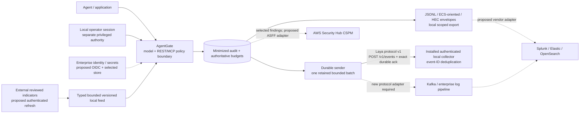

# Bank integration capabilities and acceptance boundaries

Laya Sec Layer can govern supported model/tool paths and produce minimized
security evidence for an organization's existing systems. There is **no verified
bank deployment, vendor collector integration, SOC accreditation or certification**.
A bank's public technology reference is not access, approval or compatibility.
See [release evidence](release-evidence.md) for integrated components and unverified enterprise adapters.

## Actual local delivery versus proposed adapters

The installed sender/collector uses **Laya local HTTP contract collector v1**,
not Splunk HEC, ECS ingestion, OpenSearch Bulk or a bank's internal protocol.
It validates an exact acknowledgment after durable commit, persists pending work
before HTTP and replays after a lost response. This is at-least-once delivery with
collector deduplication, not end-to-end exactly once. Root reports 51 local receipt
records/zero lag in its installed QA; [protocol tests](telemetry-delivery.md) also
cover crash, partial acknowledgment, duplicate replay, disconnection, capacity and
privacy. These results do not prove vendor ingestion or bank deployment.

ECS-oriented fields and HEC envelopes are serializers in the local export path.
They do not constitute an installed connector, index mapping, vendor receipt,
searchable event or SOC detection rule. Source audit is still authoritative;
external analytics never grants permissions or rewrites budgets. Sender lag is
reported; source retention/admission is not a bounded queue guarantee.

## Capabilities by enterprise boundary

| Boundary | Available today | Proposed adapter / required proof |
|---|---|---|
| Identity / entitlements | Hashed scoped credentials; server-owned tenant, role, agent and root; separate operator session/CSRF and explicit renewal | Selected OIDC/SSO issuer, audience/expiry/tenant mapping, least-privilege operator RBAC, revoked/wrong-scope integration cases; no bank identity connected |
| Model and data egress | Registered local model alias/private loopback proxy; bounded text inspection, no caller-selected upstream; own-tenant fixture reads/memory | Deployment network/filesystem isolation, real enterprise data connector and entitlements, permitted commercial tariffs/provider semantics; native same-user access remains a bypass boundary |
| Action approval | Immutable exact mail payload, one-use approval and replay-safe SQLite outbox | Reviewed production mail/payment connector with its own auth/idempotency/uncertainty reconciliation; no SMTP or payment-system integration claimed |
| Splunk / Splunk ES | Local HEC-envelope export | Authenticated TLS HEC sender, correct endpoint/channel/ack semantics for selected deployment, stable IDs and actual indexed/searchable proof; ES field/CIM mapping and detection rules are additional work. [HEC format](https://help.splunk.com/en/splunk-enterprise/get-started/get-data-in/9.4/get-data-with-http-event-collector/format-events-for-http-event-collector) |
| Elastic / OpenSearch | Local ECS-oriented projection | Explicit index/schema/tenant mappings, authenticated receiver/Bulk transport, per-item failures and search proof. ECS fields are a schema, not a transport; Bulk can partially fail. [ECS](https://www.elastic.co/docs/reference/ecs/ecs-event), [Bulk](https://docs.opensearch.org/latest/api-reference/document-apis/bulk/) |
| Kafka / existing pipelines | Canonical minimized event IDs and versioned local projection | New broker/producer adapter, schema/auth/topic scope, acknowledgment and consumer replay proof; not provided by the local HTTP sender |
| AWS Security Hub CSPM | Minimized decision evidence can be an input for future actionable findings | ASFF transformation, account/region/product identity, IAM and tested finding/update behavior; selected detections, not every audit line. No AWS partner certification. [Custom products](https://docs.aws.amazon.com/securityhub/latest/userguide/securityhub-custom-providers.html) |
| Threat intelligence / SOC | Typed bounded local feed validation and atomic activation | Authenticated external source, signature/version/expiry policy, reviewed matcher vocabulary and update rollback; no generic CVE patch or SOC incident-response capability |
| Secret storage | Operator-owned private token files; no browser/agent upstream key disclosure | Deployment-specific secret manager and rotation/availability integration; no named vendor retrieval verified |

Primary technical interfaces above were rechecked on 2026-10-03. They describe
what a future adapter must consume, not successful product compatibility.
No adoption statement is made about a named bank or its current architecture.

## Acceptance for a future bank pilot

1. Obtain an explicitly authorized endpoint/identity/data scope and identify
   exact product/version/schema requirements with the deployment owner.
2. Use synthetic allow, redact, pre-dispatch deny and executed-but-withheld
   outcomes. Correlate indexed stable IDs and policy versions to real gateway
   events; assert no forbidden executor/provider/outbox effect.
3. Assert no raw secret, credential, unauthorized tenant content or private
   semantic detail reaches the destination; tenant/principal identifiers remain
   operationally sensitive even in minimized exports.
4. Disconnect/throttle the receiver, inject partial errors, restart/replay and
   prove durable retained evidence, bounded pending work, deduplication and
   actionable lag/unavailable state. Record source retention policy separately.
5. Demonstrate query/dashboard visibility and measure source-to-search delay plus
   gateway overhead separately from generation/inference. Only then claim the
   specific adapter is lab-verified. Bank operational/security approval is an
   additional acceptance decision; none is assumed here.
