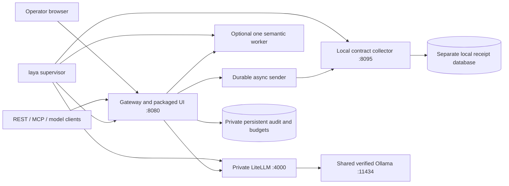

# Install and run Laya Sec Layer locally

The installed application is the gateway, operator dashboard, scoped fixture tools
and private LiteLLM adapter, plus the local telemetry sender/collector contract
lab. See [release evidence](release-evidence.md) for source and merge/QA status. It does not require Node, Cezar, a cloud API key or a
paid provider. The separate developer commands (`make setup`, `make validate`,
`make harness`) still use Node for development checks and Cezar.

## Prerequisites and first run

Use a complete checkout on macOS or Linux, with [uv installed](https://docs.astral.sh/uv/getting-started/installation/).
`./laya install` prepares Python 3.12 and the locked gateway environment from
`uv.lock`, plus a separate proxy environment from `requirements/litellm.txt`.
Source-only updates explicitly reinstall the `agentgate` package with
`uv sync --reinstall-package agentgate`; this prevents a cached stale wheel from
masquerading as the new source. Record the source head used to prepare runtimes.
The gateway is installed as a wheel with its static HTML/CSS/JavaScript assets;
there is no frontend build or CDN dependency at runtime.

Prepare a local Ollama service at `127.0.0.1:11434` with `llama3.2:1b`. The expected
model digest and provenance are in [the generation manifest](../manifests/generation-model.json).
If missing, run `ollama pull llama3.2:1b` separately, then verify the digest matches.
A tag resolving to a different digest is refused rather than silently changing the
model. The launcher checks the local version/tags HTTP APIs without inference.
It neither starts nor stops the shared Ollama service and never replaces its port.
Generation is local; the native setup cannot prevent another process of the same
OS user from contacting Ollama directly.

From the checkout root:

```sh
./laya install
```

The default operator URL is **http://127.0.0.1:8080/**. The launcher prints the
exact URL and **paths** of the operator and agent credential files, never their
contents. Open the operator credential file locally and paste its contents into
the login form. Do not put credentials in URLs, screenshots, shell arguments,
source code, shared logs, or browser storage. Operator and agent credentials are
separate; the agent credential cannot authenticate an operator session.

Default private state is `~/.local/share/laya` on both supported systems:

| Path under state | Purpose |
|---|---|
| `data/operator.token` | Operator login; not an agent/provider key |
| `data/client.token` | 24-hour agent credential for documents, memory, mail and model calls |
| `data/audit.key`, `worker.token`, `litellm.token` | Independent audit/service authority |
| `data/collector.token` | Private local contract collector credential |
| `data/collector.sqlite3` | Separate durable local receipt/deduplication database |
| `data/telemetry.json` | Installed tenant-scoped sender configuration |
| `data/agentgate.sqlite3` | Credentials, authoritative audit, live controls and budgets |
| `data/semantic-quota.sqlite3` | Production worker's persistent shared daily quota when configured |
| `data/policy.yaml`, `litellm.yaml` | Private installed configuration |
| `runtime/gateway`, `runtime/litellm` | Independent locked Python environments |
| `assets` | Optional pinned standard/CoreML model snapshots |
| `lifecycle.log` | Bounded, minimized lifecycle diagnostics |

State directories use 0700; keys and state files use 0600. Unsafe symlinks,
hardlinked data files, permissive modes, unknown/corrupt installation metadata and
existing unowned directories are refused. The launcher never overwrites an older
`agentgate init-demo` directory or adopts its processes by guessing a PID.

For another installation, use a new private directory and unused ports:

```sh
./laya install --state-dir "$HOME/.local/share/laya-demo" --port 8082 --proxy-port 4002 --collector-port 8096
```

Default ports are gateway 8080, private LiteLLM 4000, local collector 8095 and
optional worker 8091. Three services are owned by default: gateway, private
LiteLLM and collector. The gateway lifespan runs the asynchronous durable sender;
Ollama remains shared. The collector is **Laya local HTTP contract collector v1**,
not a SIEM or bank endpoint; ECS/HEC envelopes remain separate export formats.
Its private receipt database is separate from authoritative audit/budget state.
The installed local lab configuration must not overwrite an operator-selected
custom telemetry target. See [delivery semantics](telemetry-delivery.md).
An occupied port is an error with a diagnostic; the launcher does not evict its
owner. Existing gateways on 8000, a proxy on 4001, Cezar on 4322, and Ollama on
11434 remain untouched. Use the printed `127.0.0.1` origin exactly: `localhost`
is a different origin for operator authentication.

## Daily lifecycle

```sh
./laya status
./laya logs
./laya doctor
./laya stop
./laya start
```

Repeat `--state-dir` for a nondefault installation. Start is idempotent; repeated
install reuses matching prepared assets and preserves state, including revoked
or expired credentials. Changed package inputs require a stopped installation.
Port, semantic backend and question-set options are remembered; repeat
installation need not restate them. A question-set change is a profile change,
requiring the same explicit stopped-installation preparation.
To change a port or backend, stop first, then run install with the new option and
the same state directory. Changing the semantic profile updates its required flag
through an audited, versioned policy activation; unrelated policy fields remain.
Routine reinstall does not override operator changes to live policy.
Status returns zero only when the owned services and shared Ollama check are
ready. A stopped, unavailable or corrupt installation exits nonzero. Doctor checks
host support, installed interpreters, optional asset hashes and the expected local
Ollama model; it does not claim real inference, model accuracy or successful tool
execution. An absent optional backend is reported as unconfigured, not evaluated.

A private authenticated Unix socket controls the supervisor. Recorded PIDs are
observations only, never authority to signal a process. The supervisor signals
only unreaped child handles; a separate child owner stops its service if the
supervisor dies. Startup failures roll back owned children. Socket/HTTP waits
have deadlines, including slow HTTP responses. The launcher never sends a signal
to shared Ollama or to a listener discovered by its port number.

`logs` prints only bounded lifecycle diagnostics; upstream stdout/stderr are
suppressed because libraries may echo credentials or request content. Actual
security events are available through the authenticated dashboard/export, with
the gateway's normal minimized audit contract.

## Optional semantic enforcement

Default installation uses deterministic authorization, filtering, approvals and
budgets; **semantic classification is off**. Choose exactly one optional backend
when preparing an installation:

```sh
./laya stop
./laya install --semantic standard --question-set content-role-v2
# To switch the same preserved state on native Apple Silicon macOS:
./laya stop
./laya install --semantic coreml --question-set content-role-v2
```

`--question-set content-role-v2` is an explicit opt-in. Both backend and question
set are remembered and passed as matching worker/gateway flags. Default installation
remains semantic off; `content-role-v1` stays the compatibility/default question
set. Changing a stopped installation's profile increments the audited policy
revision while retaining credentials, live controls and budget history. Unknown
or mismatched question sets fail closed. These options are root-reported release
integration after merged PR32; see the ledger for final installed-head validation. Root's real installed CPU-v2
CLI/browser check at `f6bccde` demonstrated four ready owned services, ordinary
notes allowed, malicious result withheld after an executed read, tenant denial
before execution, and quota 0→2/1000. The selected profile path is real evidence
for these fixtures, not general detector quality. No CoreML rerun is implied.

V1 first-pass quality was 7/26 correct per backend and CoreML's warm run failed.
V2 was 15/28 standard and 16/28 CoreML, with false positives and missed indirect
attacks. A real CPU gateway ordinary-allow/attack-deny smoke is narrower evidence.
Standard is the preferred opt-in runtime; CoreML is experimental. Neither is an
approved general detector. Keep [v1 results](semantic-evaluation.md) visible.

These commands prepare the separately pinned requirements and download only the
files/revisions listed in [the asset manifest](../manifests/model-assets.json).
Files are size/hash verified before use. Preparation does not run evaluation;
starting a requested worker loads that backend. Run heavyweight profiles
sequentially. CoreML on Linux/non-Apple hardware is explicitly unsupported.
The installed policy requires the chosen worker; unavailable/incomplete analysis
fails closed. There is no automatic semantic or cloud fallback.

The ordinary production worker CLI owns the shared persistent call quota. Keep
`semantic-quota.sqlite3` with all other state; restart and backend changes must
not reset its spend. See [semantic worker limits](semantic-workers.md). Semantic
loading and fixed classification fixtures are not a model-quality evaluation.

## Offline restart

After dependencies and requested assets have been prepared and Ollama's exact
model is resident:

```sh
./laya stop
./laya start
```

Start runs installed executables directly, with Hub/Transformers offline mode,
local LiteLLM cost metadata, no inherited cloud/proxy credentials, and no package
resolution or asset downloads. Shared Ollama must remain available locally.
`./laya install --offline --no-start` can prepare from an already complete uv/model
cache; a missing dependency or model fails explicitly. It does not mean an empty
machine can install without cached software.

## Updates, backup and recovery

Stop this installation before changing its checkout/runtime. Back up the entire
private state directory while it is stopped; that includes audit HMAC material,
credentials, SQLite databases, budgets, approvals, active policy/feed and optional
semantic quota. Keep backups private. Then run `./laya install` from the updated
complete checkout using the same state directory. A changed source fingerprint
forces a fresh application wheel even when the package version is unchanged;
an unchanged fingerprint skips package installation. Before additive gateway schema
migration, the installer retains a SQLite backup as `data/before-migrate-*.sqlite3`.
It does not reissue keys, reset spend or overwrite the activated policy/feed.

The pre-migration SQLite copy alone is **not** a complete restore point; retain the
whole-directory backup. Never run old and new gateway binaries concurrently
against the same database. Rollback requires stopping and restoring a reviewed
compatible whole snapshot; do not delete budgets/credentials to make a demo pass.

Unknown legacy demo directories are intentionally not adopted. Stop their actual
owner and follow [the existing schema migration runbook](budgets.md#upgrading-existing-local-state)
with the original private keys. This launcher does not claim ownership of legacy
processes without its private control channel.

Failed initial provisioning preserves `initializing/` for inspection rather than
silently replacing authority. A `.new` file or corrupt installation metadata also
requires inspection against a private backup. Fix permissions to 0700/0600 only
when the directory/files are yours; do not follow links or recursively chmod
unrelated environments. A failed health check leaves a terse explanation in
`./laya logs`. Port conflicts require choosing an unused port, not killing an
unknown process.

Agent credentials expire after 24 hours. Operator sessions last 15 minutes and
can be reacquired with the separate operator token. The operator playground's
credential lifecycle is specified in [the control-plane contract](control-plane-contract.md).
Restart/reinstall does not renew expired authority or revive revoked authority.
For an expired credential, stop the installation and explicitly renew:

```sh
./laya stop
./laya renew-agent
./laya renew-playground --scope tools
./laya renew-playground --scope model
./laya start
```

Renew only the expired scopes you need. Still-active, revoked or unissued authority
is refused. Agent rotation writes/fsyncs a private pending file before its database
commit; retry recovers the exact committed replacement after a crash. Identity,
root spend and history remain unchanged. The new agent token is available only in
`data/client.token`; the command prints its path. Playground tokens remain internal,
with separate durable tools/model epochs. Pending approvals from an old authority
must be proposed with a fresh idempotency key and approved again after renewal.
Never replace state or change root IDs to work around expiry or budgets.

## Scope and evidence

See [the visual architecture](architecture.md), [full deployment design](../AgentGate_Full_Project_Architecture.md#17-deployment-architectures)
and [full-stack scope](../.ai/specs/full-stack-delivery.md). The diagram below shows
installation ownership, not an OS sandbox:



`tests/test_lifecycle.py` uses real subprocesses/HTTP and real state provisioning;
package downloads and Ollama discovery are declared fixtures in isolated install
unit tests. Those tests are not full application or real-model evidence. The actual clean-install run at `c5b918e` on macOS arm64 served the bundled UI,
authenticated an operator session, enforced cross-tenant document denial, queried
tenant-scoped memory, and committed exactly one approved local outbox message.
MCP initialization/tool discovery and authenticated `local-demo` discovery passed.
A prepared restart under `UV_OFFLINE=true` completed in 5.4 seconds, retaining
credentials, audit rows, budgets, outbox and configuration exactly. This was a
restart without downloads, not a host network-isolation test. Default port 4000
correctly refused an existing listener; that run explicitly selected 4002.
The separate wheel-upgrade regression builds actual wheels with offline uv,
changes only packaged JavaScript at the same package version, and verifies the
installed asset changes while authority remains unchanged.

No generation or semantic inference was run for installer evidence. The optional
standard/CoreML profile preparation paths have fixture/manifest checks; an actual
heavyweight profile installation was not part of this run. Native Linux launch
is not claimed by the macOS smoke (Linux CI runs the deterministic suite). Root owns the final browser/delivery QA. Hermes, enterprise SSO, vendor
certification, network isolation and real semantic evaluation are separate work.

## Installed QA evidence and developer helper

Root reports a real local QA cache/lifecycle check in ignored
`.ai/qa/artifacts_fullstack/qa-cache-lifecycle.json`: warm reuse 0.244 seconds,
source touch prevented reuse, repeated stop was idempotent, restart 7.406 seconds,
and keys, credential epochs and tool/model ledgers were preserved. These single
local observations are not portable startup targets or model-quality results.

Executable `.ai/scripts/test-env-up.sh` / `test-env-down.sh` use the product
launcher for an isolated QA installation. They are developer helpers, separate
from `./laya install` for users. `tests/frontend/browser_check.py` exercises the
installed operator UI; `--model` adds an actual configured-provider smoke and
requires separately prepared Playwright/browser tooling. Keep reports/screenshots
ignored and sanitized. Root owns the final current-head browser/collector gate;
this documentation task does not run another model or alter its QA installation.

## Changing the owned collector port

Re-run `./laya install --collector-port <unused-port>` with the same state path.
The stopped installation retains the same collector database/key and source
ledger. Under an exclusive sender lock it migrates the checkpoint binding while
preserving cursor, acknowledged counts, pending batch and retry state. An already
ingested batch can replay safely through event-ID deduplication. Interrupted
checkpoint/config publication can be retried without resetting delivery history.
A busy sender, unknown origin/tenant, invalid source anchor or missing private
collector database is rejected. This operation does not authorize migration to an
arbitrary remote destination.

For an explicitly trusted computer, `./laya install --local-console` opts into the
[login-free local console](local-console.md). New/legacy installations stay in
credential mode by default; reinstalls remember the choice. Stop and reinstall
with `--no-local-console` to disable it without resetting private authority or
budgets. This capability is loopback-only and trusts same-host OS clients.
