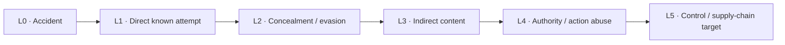
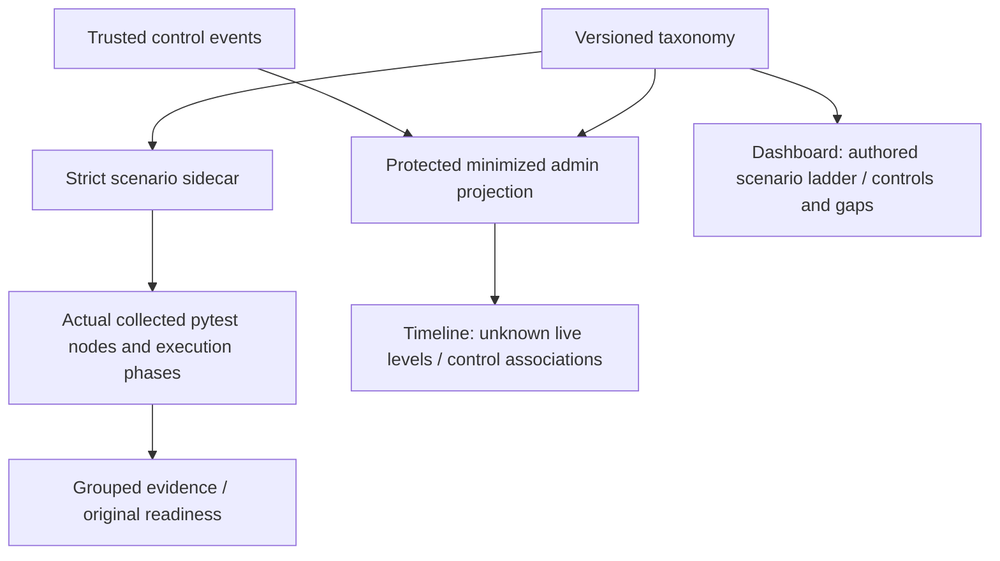

# Two-axis threat evidence

Laya Sec Layer uses `laya-threat-v1` to describe **authored scenario types** on
L0–L5 and affected system layers on a separate axis. This is an explanatory scheme,
not an ordinal severity score, a probability, OWASP certification, or a new defense.
The reviewed [design record](../.ai/specs/2026-10-04-threat-ladder.md), including its
independent-review resolutions, governs this implementation.

| Primary level | Authored assignment | Existing narrow controls | Limits still visible |
|---|---|---|---|
| L0 Accident | Ordinary mistake, accidental disclosure/resource use, benign control | Bounded synthetic-secret/email protection; budgets | No PESEL/IBAN/card recognition |
| L1 Direct known attempt | Explicit prohibited instruction, model or operation | Registered routing, scopes, deterministic permissions | No universal jailbreak detector |
| L2 Concealment/evasion | Encoding, representation, fragmentation or paraphrase | Buffered split-secret checks; experimental semantics | No general base64/Unicode normalization; missed paraphrases |
| L3 Indirect content | Explicit untrusted document/retrieval/tool carrier | Scoped reads and output inspection | Semantic false positives; active-image exfiltration unsupported |
| L4 Agent authority/action abuse | Delegated scope, composition, exact approval/root authority | Immutable approvals, scoped reads, shared root accounting | No public delegation API or broad multi-step exfiltration correlation |
| L5 Control/supply-chain target | Availability/integrity of controls, stores, quotas, artifacts | Last-good policy/feed CAS, audit, quotas, metadata intake | No signatures, four eyes, generic rate limit or GPU-time budget |



The arrows organize a teaching ladder, not escalating observed severity. Levels
can overlap. One primary authored axis foregrounds the defining maneuver:
compact explicit overrides in frozen untrusted-content fixtures use L1 (L3 carrier
overlap); paraphrased prohibited behavior uses L2; attacks embedded after ordinary
archive/facilities document text (`long-en/pl`, `appendix-en/pl`) use L3 to foreground
the indirect carrier (L1 instruction and L2 placement overlap). Benign security
quotations exercise L3 interpretation; negations and ordinary text are L0 controls.
T38's aggregate false-positive check is an L0 benign control; its individual quoted
fixtures carry L3. T40 is an untrusted-content language-slice umbrella; T43 is an
ordinary backend comparison, with individual cases classified separately. These
choices are explicit rationales, not conclusions inferred from observed outcomes.
Over-capacity fixtures use L5 for the control-limit probe and include consumption /
LLM10; ordinary long input is not thereby declared hostile.

| Stable layer, in user order | Meaning / Polish definition |
|---|---|
| `identity` | Identity and permissions / tożsamość i uprawnienia |
| `input` | Input / wejście |
| `data` | Data / dane |
| `actions` | Actions / działania |
| `output` | Output / wyjście |
| `consumption` | Resource consumption / zużycie zasobów |
| `supply_chain` | Supply chain / łańcuch dostaw |

Crosswalks intentionally reference [OWASP LLM 2025](https://genai.owasp.org/llm-top-10/)
and [Agentic Applications 2026](https://genai.owasp.org/resource/owasp-top-10-for-agentic-applications-for-2026/)
(published December 9, 2025). They are our control associations, not evidence of
confirmed vulnerabilities. Scenario associations are reviewed individually:
T11 synthetic-secret input and T12 email redaction reference LLM02 disclosure;
`input` alone never establishes prompt injection or goal hijack.

## Authored metadata and actual executions

[The strict sidecar](../testdata/test-cases.json) references exactly T01–T48 plus
26 v1 and 28 v2 frozen cases by dataset and stable ID. It contains no copied
content or altered expected labels. It declares original corpus byte SHA-256,
freeze-manifest and question-set references. Validation checks current corpus
bytes against the original manifest corpus entries; it does not call `load_frozen`
on the later inference engine, modify old freeze files, import historical reports,
re-evaluate a model, or attach old measurements to a new question/backend.

The [existing acceptance runner](acceptance.md) preserves schema-1 fields and adds
version-1 `threat_evidence`: index/taxonomy/source/corpus digests, original readiness,
exact collected/selected/deselected pytest node IDs, setup/call/teardown observations,
and per-level/per-layer summaries. `PYTEST_ADDOPTS` cannot narrow the intended gate.
A mapped selector requires every collected parameter to finish all phases once and
pass. Missing parameters, failure, skip, duplicate/unexpected observations,
deselection, collection error or early termination cannot satisfy the scenario.
The process is bounded to 300 seconds and 10,000 collected nodes.

Declared scenarios, per-kind readiness, narrow control-check status, unique
collected nodes, and unique observed nodes are separate denominators. Shared test
nodes are deduplicated in each group and are never independent attack samples.
Layer groups overlap and must not be summed as a global attack count. `partial`
stays partial even after its narrow checks pass; `measured` and `gap` never acquire
synthetic semantic successes. All 54 semantic sidecar cases remain declared,
measured elsewhere / not run by this command. Existing [v1 failures](semantic-evaluation.md)
and [v2 false positives/missed attacks](semantic-v2-evidence.md) remain disclosed.

## Operator presentation and privacy

Protected `GET /admin/threat-taxonomy` reuses the operator session boundary.
`/admin/events` adds only a minimized version-1 `threat_context` projection:

```json
{
  "schema_version": 1,
  "taxonomy_version": "laya-threat-v1",
  "candidate_levels": [],
  "level_status": "unknown",
  "basis": "control_context_only",
  "intent": "not_assessed",
  "layers": ["identity", "data"],
  "owasp": ["ASI03:2026", "LLM06:2025"]
}
```

**Every current live event has an unknown level.** No authenticated scenario
attribution exists. Denials, semantic scores, repetition, budget use, prompt text
and request parameters never establish attacker sophistication. A finite trusted
reason/event/operation table associates affected controls; unmapped errors and
generic successful actions get empty associations. Approval lifecycle context is
not a claim of trust exploitation. No raw prompt inspection or inference is added.



The overview ladder shows authored controls/gaps; timeline filters apply only to
the marked latest-100 loaded event window. L0–L5 selections intentionally have no
classified live observations; unknown and overlapping layer filters remain useful.
Missing/old context renders unknown. Empty, loading, failure and narrow-screen
states retain safe text rendering, labels, keyboard navigation and focus behavior.
No live attack-distribution chart is synthesized from authored scenario counts.

REST, model and actual MCP-wire privacy regressions use distinctive **fixture**
native scores to verify no client-visible score/threshold/question/checkpoint data,
zero forbidden dispatch/output, durable ID correlation, minimized admin timelines,
and exact unchanged export-v1 keys. A provider's permitted work can occur before
blocked output; its usage is still settled. There is no `SemanticCheck.java` here
and no Java leak fix is claimed. Binary allow/deny feedback still exists; removing
numeric feedback does not defeat adaptation.

No persisted AuditEvent, database, public REST/model/MCP body/reason/status/default,
telemetry-v1 or export-v1 change is made. See [compatibility](../BACKWARD_COMPATIBILITY.md).
New DLP, signed feeds, two-person administration, OIDC, delegated user/agent
permission intersection and risk-scored catalogs are separate future stories.
Installed browser QA is executable in `tests/frontend/threat_ladder.py`; runtime
artifacts stay ignored. The EN/PL sources add one ladder slide for ten pages each;
root owns later product-story/deck finalization and independent pre-merge QA.
