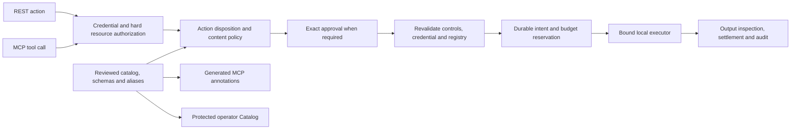

# Approved tool catalog and local policy risk

The reviewed, immutable catalog contains exactly `documents.read`, `memory.query`
and `mail.send`, bound to their actual executors, effects and approval dispositions.
It extends architecture §§7, 14–15 without adding identity/delegation behavior.

| Operation | Actual adapter | Potential data | Action policy |
| --- | --- | --- | --- |
| documents.read | Tenant document fixture store | Classified content; authorize selected resource before read | Automatic after hard authorization |
| memory.query | Credential tenant's synthetic memory rows | Classified content; query only permitted classifications | Automatic after hard authorization |
| mail.send | One local fixture outbox record | Unclassified caller-submitted text; exact domain/content checks | Exact human approval, revalidated before insert |

Reads declare no mutation or direct person effect. Mail may affect a person as an
operation class; this adapter only retains a local record. No SMTP, real email
delivery, bank or GitLab connection is implemented. Potential exposure does not
classify a request as PII or special-category data. Credential scope and active
policy roles, resource tenant/classification and mail domains constrain actual
access. Output inspection, configured semantic controls and budgets still apply.

Read paths skip the approval pause. Risk never grants permission or overrides a
hard denial. Mail approval is mandatory at every score. Unregistered operations
and destructive effects have no reviewed executor/policy path and deny before
dispatch.

## Exact formula

`tool-policy-heuristic-v1` sums these named components into an integer in **0–100**:

| Component | Weights |
| --- | --- |
| effect | read 0; write 25; destructive 45 |
| potential_data | public 0; classified_content 25; unclassified_submitted_text 25 |
| exposure | tenant_scope 0; approved_destination 10 |
| reversibility | no_mutation 0; local_record_retained 5; external_system_dependent 10 |
| affects_person | false 0; true 10 |

Bands: low **0–24**, moderate **25–59**, high **60–100**. Current document/memory
scores are **25 = 0+25+0+0+0**; local mail is **75 = 25+25+10+5+10**. The formula's
possible endpoints are 0 and 100; a destructive risk example installs no executor.
This is a local policy heuristic, not probability, a scoring model, semantic/native
inference, an OWASP level or AI Act legal high-risk classification. No inference
computes the score.

## Contracts and trust

`GET /admin/catalog` uses the existing operator session and exact-origin boundary,
accepts no query parameters, and returns a fixed inventory of three tools and two
proposed examples. `version: approved-tools-v1`, the registry digest, captured
active policy version, metadata, risk components and actual active policy
requirements are included. No credentials, request payloads, model scores or
per-resource data are exposed. It is read-only: metadata changes require source
review/deployment, not caller input or policy JSON edits. The lazy-loaded Catalog
view uses text nodes and supports keyboard/narrow layouts and missing, incompatible,
empty, service-error and expired-session states.

`GET /v1/tools` keeps the existing `{"tools":[canonical names...]}` shape and
credential/policy filtering. MCP names, schemas and results remain compatible.
Optional standard annotations derive from reviewed metadata: reads declare
`readOnlyHint=true`; local mail declares false. All three declare
`destructiveHint=false`, `idempotentHint=true`, `openWorldHint=false`. Mail
idempotency means repeating the same immutable key/arguments only. Hints describe
the local adapter and never grant authority. Client `_meta`, descriptions or
annotations cannot downgrade metadata. Hint keys inside strict tool arguments
are rejected. Undiscovered direct calls are still authorized. AgentGate is not
a generic remote MCP proxy.

Dev `gitlab.merge_main` and Finance `payments.transfer` examples are explicitly
proposed/unavailable, outside the executable registry and REST/MCP discovery. A
merge is consequential; reversibility depends on history/policy. Payment
reversibility depends on the external system. Direct calls deny with
`UNKNOWN_OPERATION` and no effect.

## Registry upgrade and safe reproposal

The `scoped-tools-v2-approved-catalog` digest binds aliases, input schemas,
catalog version/all metadata, formula version/weights and derived components,
score and band. Changes invalidate pending/approved mail (`POLICY_CHANGED`) before
dispatch. Stored snapshots, fingerprints, registry/policy digests, expiry and
prior spend are never rewritten. There is no SQLite or export-v1 migration.

Stop the old serving binary and rebuild/reinstall the wheel. Do not run mixed
registry versions against one authority. Refresh/resume/decision revalidates old
pending actions. The old key remains bound to the old action. Deliberately submit
reviewed intended content with a **new idempotency key**, review its new exact
snapshot, approve, then resume. Approval alone does not execute. Never delete
prior rows or reset counters for this upgrade.

Consumed actions remain terminal. Identical execute/resume with the same live
owning credential acknowledges the prior fixture result and preserves action ID,
one outbox row and spend across a registry upgrade. This is not permission for a
new effect. Wrong ownership and revoked/expired credentials remain denied. Binary
rollback can likewise invalidate new pending actions: require deliberate review,
preserve authority and stop serving before backup/rollback.

## Proof limits

Unit tests cover formula/band boundaries and invalid metadata. Functional tests
assert rendered catalog, approval labels, unavailable examples and UI states.
REST/admin/official-SDK MCP integration asserts actual auth, policy, approval
snapshots, SQLite rows/counters and negative paths with zero forbidden effects.
Rebuilt installed-app browser QA proves actual protected backend consumption and
approval/outbox behavior. Mocked browser consumers prove only rendering/states
and are reported separately. None is real-model evaluation or evidence of an
external bank/GitLab connection.
